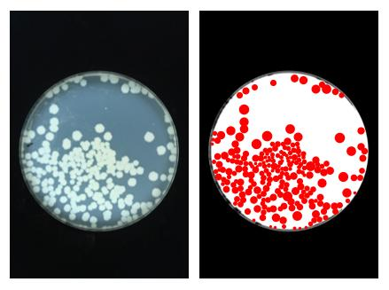

# beadsPlating
Code and data Prusokas A, Hawkins M, Nieduszynski CA,  and Retkute R. "The effectiveness of glass beads for plating cell cultures" 
https://www.biorxiv.org/content/10.1101/241752v3

Figure 1. CFUs imges and reconstructed colonies.

